---

## [Pitch, Rhythm and Musical Mastery]{#slide-1}

Musical mastery is measured by two standards — pitch control (hitting the right note without wavering) and rhythmic precision (landing on the beat at exactly the right moment). When singers or musicians miss these marks, listeners immediately perceive the resulting tonal or timing dissonance.

[Next &rarr;](#slide-2)

---

## [The Price of Musical Precision]{#slide-2}

Hitting the right note and landing on the beat consistently require countless hours of dedicated practice to eliminate dissonance and timing inconsistencies. The transition from untrained performance to musical mastery is built through persistent, repetitive effort.

{width=70%}

[&larr; Prev](#slide-1) | [Next &rarr;](#slide-3)

---

## [Auto-Tune and Quantization]{#slide-3}

Electronic music embraces digital tools like Auto-Tune (which corrects pitch to the nearest correct note) and quantization (which snaps rhythm to a perfect grid) to solve the challenges of musical precision. 

{width=70%}

[&larr; Prev](#slide-2) | [Next &rarr;](#slide-4)

---

## [What Software Can Bypass]{#slide-4}

Software solutions like Auto-Tune and quantization allow musicians to potentially bypass the long hours of dedicated practice traditionally required to master pitch and rhythm. Technology can shortcut the disciplined repetition that separates untrained performance from professional musicianship.

{width=70%}

[&larr; Prev](#slide-3) | [Next &rarr;](#slide-5)

---

## [Top 30 Electronic Music Records]{#slide-5}

A Music Radar listing of the top 30 electronic albums of the past 30 years demonstrates that electronic music's reliance on digital tools has not prevented it from producing artistically celebrated work. These records raise the question of whether technology diminishes or redefines creativity — and suggest that great art depends on the vision of the artist, not the absence of tools.

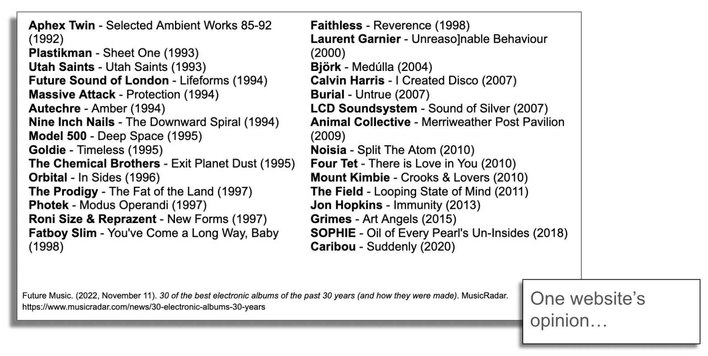{width=80%}

[&larr; Prev](#slide-4) | [Next &rarr;](#slide-6)

---

## [The Tension of Technology vs. Humanity]{#slide-6}

When artists lean too heavily on technology, the resulting work can feel uninspired and stripped of humanity. Daft Punk's 2013 album *Random Access Memories* deliberately stepped away from heavily quantized production to emphasize live musicians and human performance, raising the central question of: "How do we use powerful technology without erasing the human qualities that make art feel alive?"

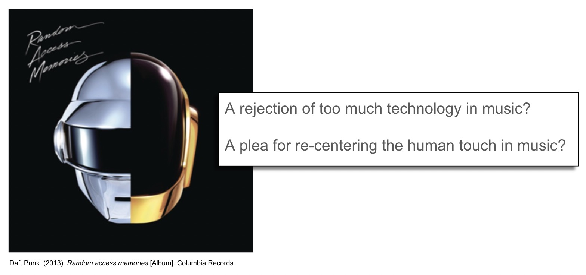

[&larr; Prev](#slide-5) | [Next &rarr;](#slide-7)

---

## [AI and the Duality of Technology]{#slide-7}

The same tension that exists between musical technology and musicianship applies directly to AI in academic contexts. Used well, AI can arguably extend and support students' capabilities.  But used as a substitute for careful thinking and practice, it can erode the core skills that education is meant to build. 

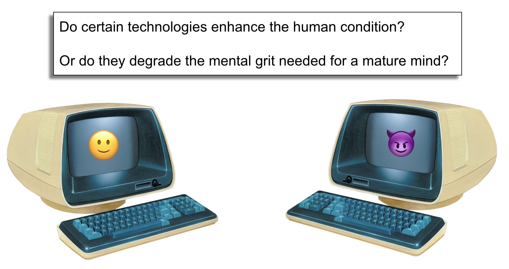

[&larr; Prev](#slide-6) | [Next &rarr;](#slide-8)

---

## [The Scholarly Boundary]{#slide-8}

While general-purpose LLMs have been trained extensively on broadly documented subjects and can be remarkably reliable in those areas, scholarly research demands specialized knowledge developed within specific disciplines, traceable sources, and the ability to verify claims — requirements that LLMs largely cannot fulfill. 

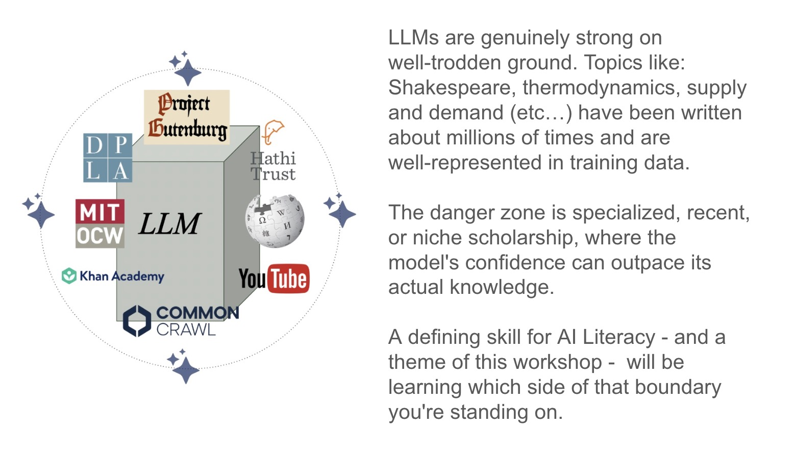

[&larr; Prev](#slide-7) | [Next &rarr;](#slide-9)

---

## [How Many 'R's Are in 'Strawberry'?]{#slide-9}

The famous example of LLMs failing to count the letters in "strawberry" reveals an important truth about these systems — they are token prediction machines, not computation engines, and tasks like character-level counting or precise arithmetic fall outside their core design. 

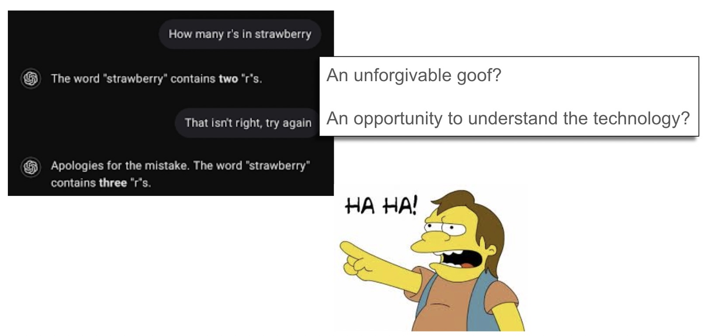

[&larr; Prev](#slide-8) | [Next &rarr;](#slide-10)

---

## [The Static Model Problem]{#slide-10}

Even the most capable LLMs have a fundamental structural limitation: their knowledge is frozen at the point their training ended, making them unable to access proprietary databases, current events, new research, or niche institutional knowledge. 

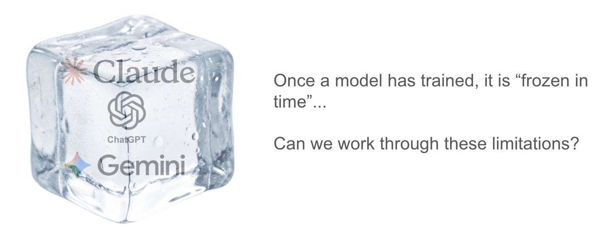

[&larr; Prev](#slide-9) | [Next &rarr;](#slide-11)

---

## [Prompt Engineering]{#slide-11}

Prompt engineering is the practice of carefully crafting and structuring the input provided to an LLM to guide it toward more accurate, relevant, and useful outputs. Rather than typing a basic question, effective prompt engineering uses specific instructions to shape the model's reasoning process.

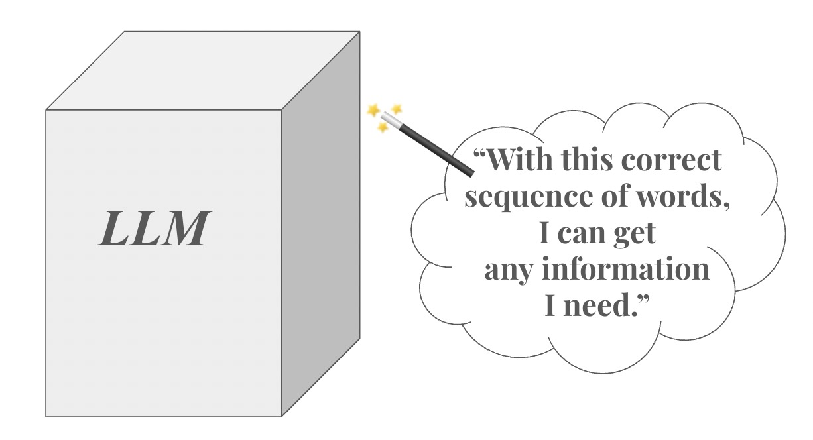{width=70%}

[&larr; Prev](#slide-10) | [Next &rarr;](#slide-12)

---

## [The CoStar Framework]{#slide-12}

The CoStar framework provides a structured method for prompt engineering, covering six key dimensions: Context, Objective, Style, Tone, Audience, and Response format. 

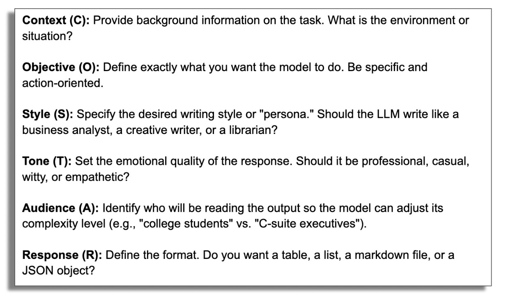{width=80%}

[&larr; Prev](#slide-11) | [Next &rarr;](#slide-13)

---

## [Chain of Thought Prompting]{#slide-13}

Chain of Thought prompting encourages an LLM to break down complex problems into intermediate steps—thinking out loud—before arriving at a final answer, which reduces hallucinations, improves logical reasoning, and keeps the human reviewer able to identify where the reasoning went off track. 

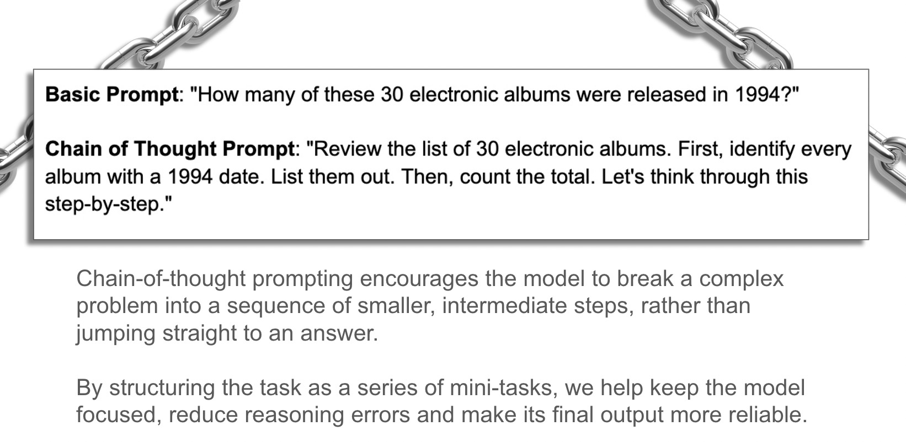{width=80%}

[&larr; Prev](#slide-12) | [Next &rarr;](#slide-14)

---

## [The Limits of Prompt Engineering]{#slide-14}

While prompt engineering can meaningfully improve LLM outputs, it cannot compensate for missing data, outdated knowledge, or weak underlying sources - no clever phrasing can produce reliable answers when the model lacks the right information in the first place. 

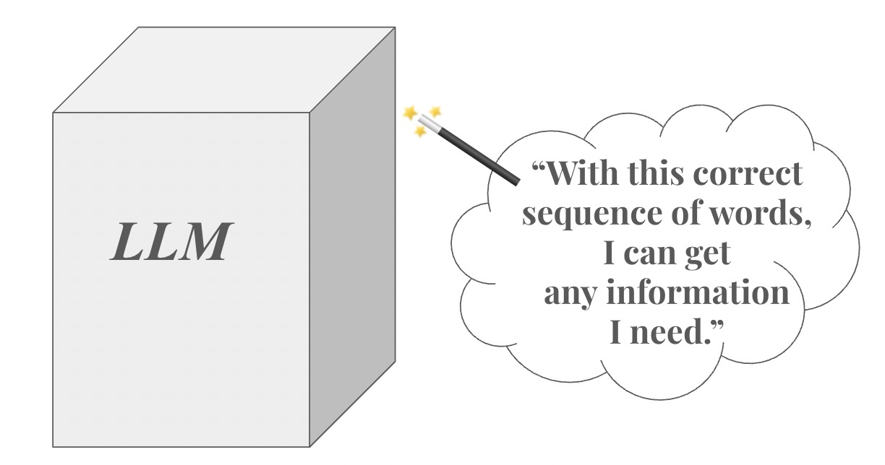{width=70%}

[&larr; Prev](#slide-13) | [Next &rarr;](#slide-15)

---

## [Context Engineering]{#slide-15}

Context engineering goes beyond prompt engineering by focusing not just on how you instruct an LLM, but on what information you supply to it - curating and structuring the data in the model's prompt window so that responses are grounded in accurate, specific sources rather than statistical guessing. 

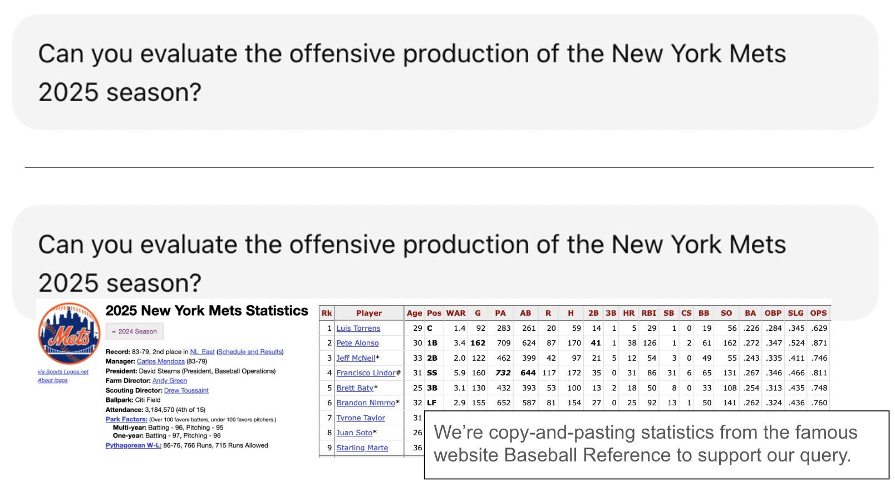{width=80%}

[&larr; Prev](#slide-14) | [Next &rarr;](#slide-16)

---

## [The Training Data Gap]{#slide-16}

Frontier LLMs are primarily trained on the open web, leaving a massive gap in their knowledge of peer-reviewed research and high-quality academic facts. This structural limitation means that AI models often lack access to the very sources that define scholarly authority and rigor.

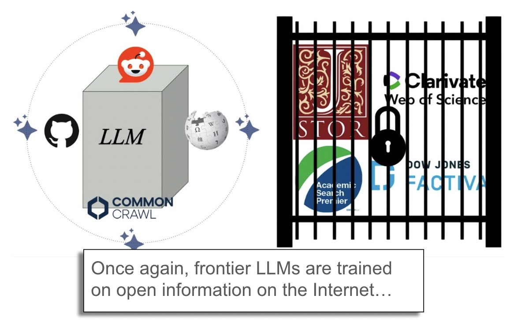{width=80%}

[&larr; Prev](#slide-15) | [Next &rarr;](#slide-17)

---

## [RAG: Retrieval-Augmented Generation]{#slide-17}

Retrieval-Augmented Generation (RAG) is a sophisticated extension of context engineering that automates the process of feeding an LLM specific, high-quality information that was never part of its original training - retrieving actual documents from databases and placing them directly into the model's active context. 

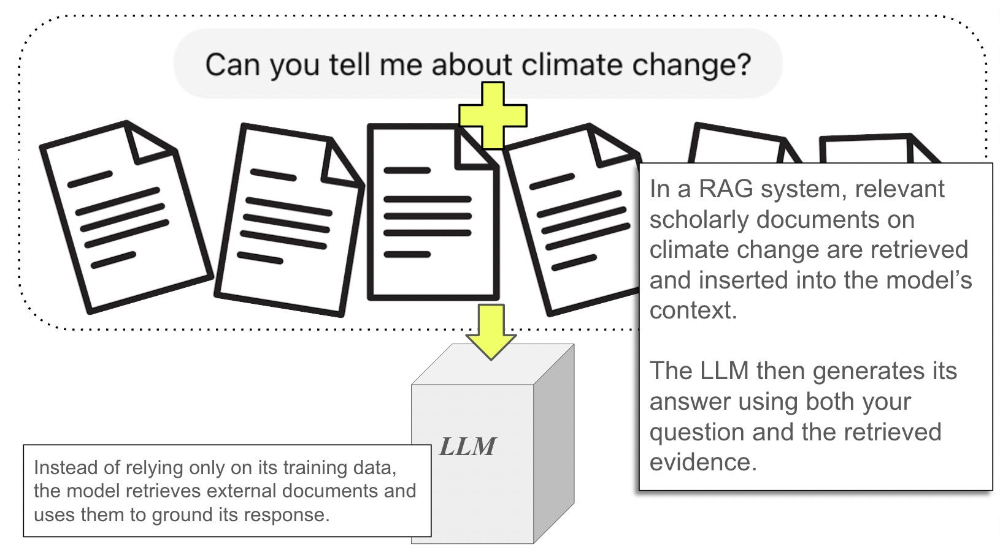{width=80%}

[&larr; Prev](#slide-16) | [Next &rarr;](#slide-18)

---

## [Google NotebookLM]{#slide-18}

Google's NotebookLM demonstrates RAG in practice by allowing users to build a private research environment from their own uploaded documents, restricting the AI's responses to those specific sources and providing traceable citations for every claim.  NotebookLM reduces hallucinations by ensuring the model can only draw on materials the user has deliberately provided.

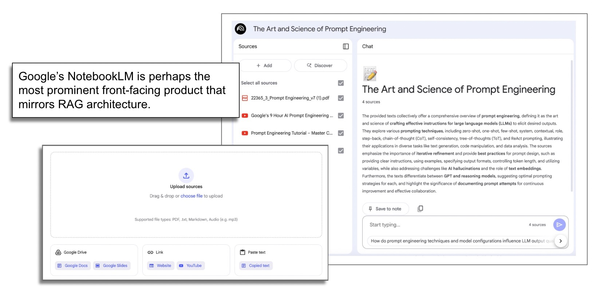

[&larr; Prev](#slide-17) | [Next &rarr;](#slide-19)

---

## [Too Many Tabs?]{#slide-19}

Imagine the ability to simultaneously evaluate countless websites and synthesize the findings into a single structured report?

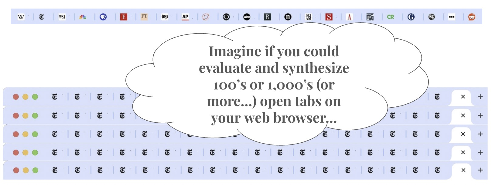

[&larr; Prev](#slide-18) | [Next &rarr;](#slide-20)

---

## ["Deep Research" vs. The Scholarly Record]{#slide-20}

AI "Deep Research" tools have radically changed information gathering by shifting from instant answers to multi-step research workflows that propose structured plans, scan live websites, and synthesize findings from multiple sources. However, these tools are limited to the open web and exclude essential scholarly databases, subscription journals, and paywalled resources.

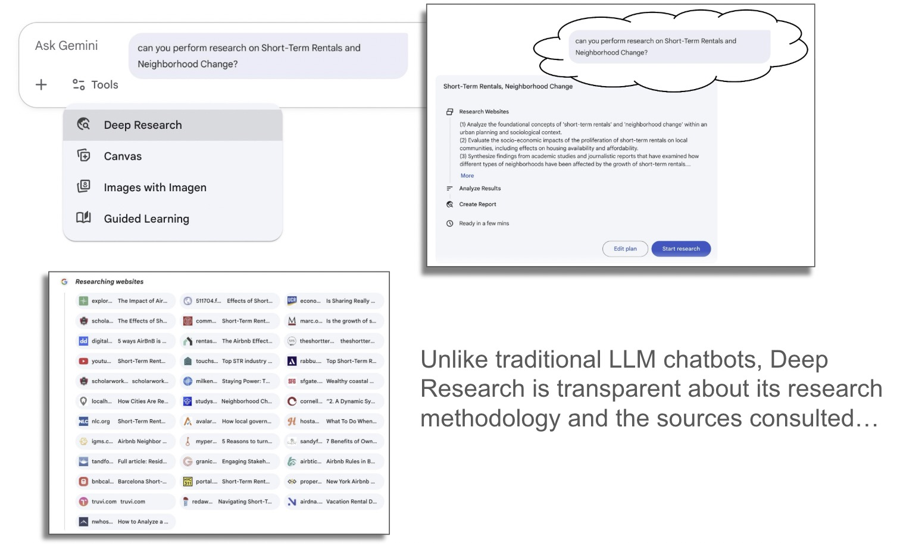{width=90%}

[&larr; Prev](#slide-19) | [Next &rarr;](#slide-21)

---

## [The Deep Research Report]{#slide-21}

While Deep Research produces impressively formatted, report-like outputs that mirror scholarly rigor in appearance, students should be cautious about treating them as comprehensive research.  The polished appearance of AI-generated reports can create a misleading impression of thoroughness that does not reflect the full scholarly record.

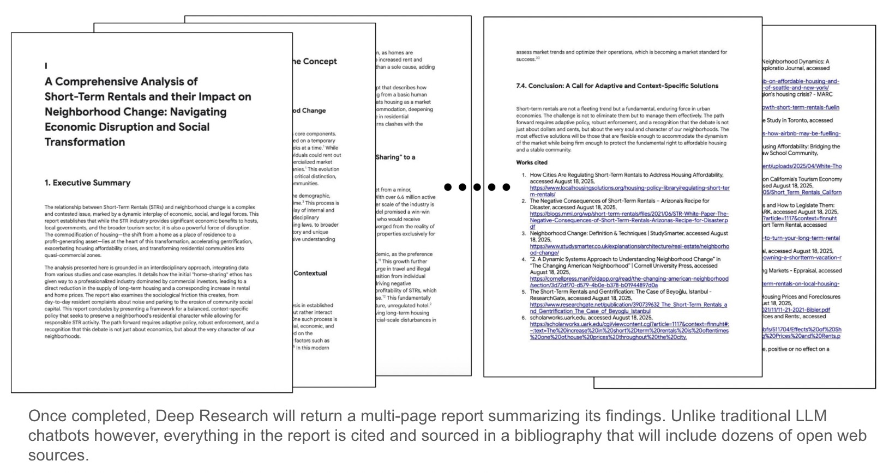{width=90%}

[&larr; Prev](#slide-20) | [Next &rarr;](#slide-22)

---

## [AI Tools for Literature Reviews]{#slide-22}

Specialized AI research tools use semantic and vector matching to go beyond simple keywords, surfacing papers about related concepts even when the exact search terms don't appear.

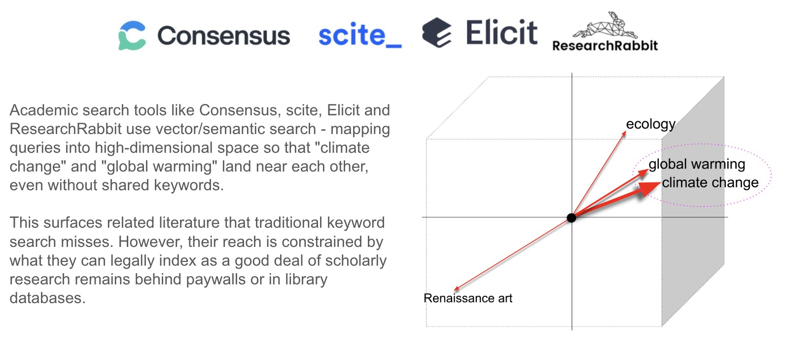

[&larr; Prev](#slide-21) | [Next &rarr;](#slide-23)

---

## [Where Traditional Search Can Fail]{#slide-23}

Traditional search systems rely on metadata - structured information like titles, authors, and subject tags - to organize and retrieve resources, which creates limitations when images, documents, or ideas lack precise descriptive tags.

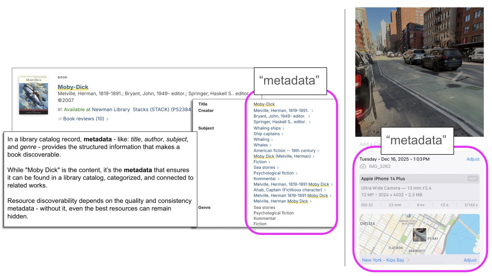

[&larr; Prev](#slide-22) | [Next &rarr;](#slide-24)

---

## [Search Strings and Keyword Creation]{#slide-24}

In library catalogs and most databases, search is driven by lexical matching - exact character-string comparisons between your query and the metadata attached to a resource - which means that a search for "falsely accused" may miss a book titled "Wrongly Convicted" even though the concepts are identical.

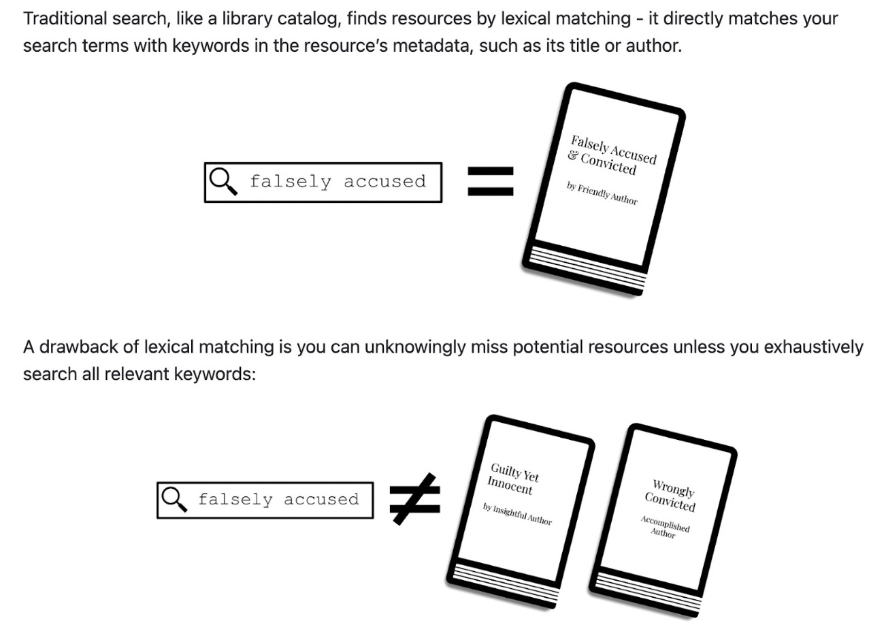{width=90%}

[&larr; Prev](#slide-23) | [Next &rarr;](#slide-25)

---

## [AI for Keyword Creation]{#slide-25}

Because most library catalogs and databases still rely on keyword matching rather than semantic search, users can use AI chatbots outside those tools to generate expanded keyword lists and search strings that bridge vocabulary gaps.

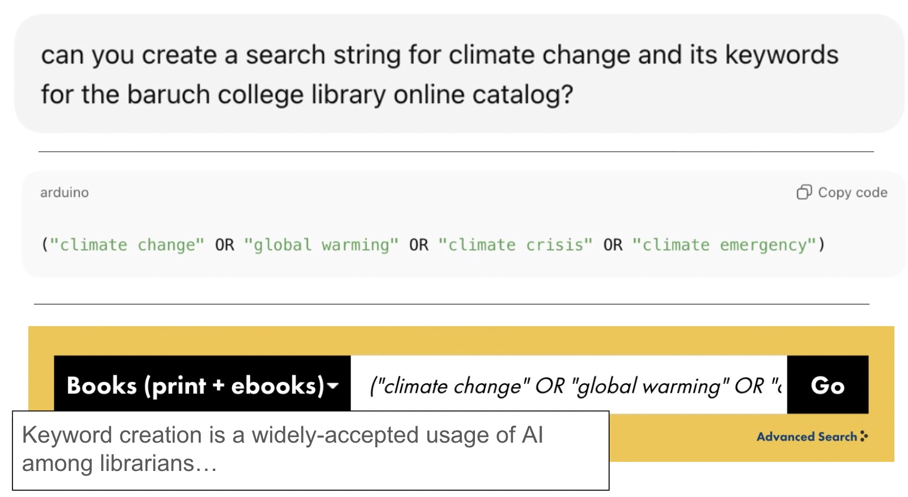{width=90%}

[&larr; Prev](#slide-24) | [Next &rarr;](#slide-26)

---

## [Taking Control of Google Search]{#slide-26}

By asking an AI chatbot to generate a Boolean search string using Google's `site:` operator, researchers can bypass algorithmically-ranked results and restrict their search to specific high-quality publications and intellectual forums.

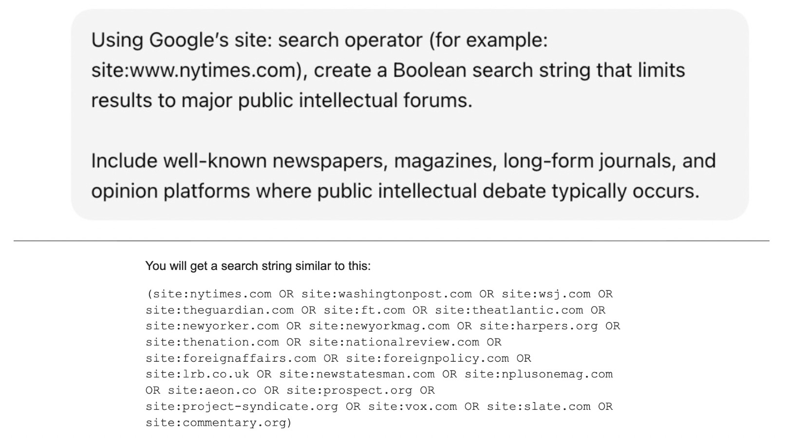

[Let's investigate this search...](https://www.google.com/search?q=climate+change+(site%3Anytimes.com+OR+site%3Awashingtonpost.com+OR+site%3Awsj.com+OR+site%3Atheguardian.com+OR+site%3Aft.com+OR+site%3Atheatlantic.com+OR+site%3Anewyorker.com+OR+site%3Anewyorkmag.com+OR+site%3Aharpers.org+OR+site%3Athenation.com+OR+site%3Anationalreview.com+OR+site%3Aforeignaffairs.com+OR+site%3Aforeignpolicy.com+OR+site%3Alrb.co.uk+OR+site%3Anewstatesman.com+OR+site%3Anplusonemag.com+OR+site%3Aaeon.co+OR+site%3Aprospect.org+OR+site%3Aproject-syndicate.org+OR+site%3Avox.com+OR+site%3Aslate.com+OR+site%3Acommentary.org)&oq=climate+change+(site%3Anytimes.com+OR+site%3Awashingtonpost.com+OR+site%3Awsj.com+OR+site%3Atheguardian.com+OR+site%3Aft.com+OR+site%3Atheatlantic.com+OR+site%3Anewyorker.com+OR+site%3Anewyorkmag.com+OR+site%3Aharpers.org+OR+site%3Athenation.com+OR+site%3Anationalreview.com+OR+site%3Aforeignaffairs.com+OR+site%3Aforeignpolicy.com+OR+site%3Alrb.co.uk+OR+site%3Anewstatesman.com+OR+site%3Anplusonemag.com+OR+site%3Aaeon.co+OR+site%3Aprospect.org+OR+site%3Aproject-syndicate.org+OR+site%3Avox.com+OR+site%3Aslate.com+OR+site%3Acommentary.org)&gs_lcrp=EgZjaHJvbWUyBggAEEUYOdIBCDMwMzBqMGo0qAIDsAIB8QUanptnvC-glg&sourceid=chrome&ie=UTF-8)

[&larr; Prev](#slide-25) | [Next &rarr;](#slide-27)

---

## [Fine-Tuning]{#slide-27}

Fine-tuning involves further training an LLM on a smaller, task-specific dataset to make it an expert in a particular domain — like law, medicine, or academic literature — by updating its internal parameters to master specialized vocabulary and disciplinary logic.

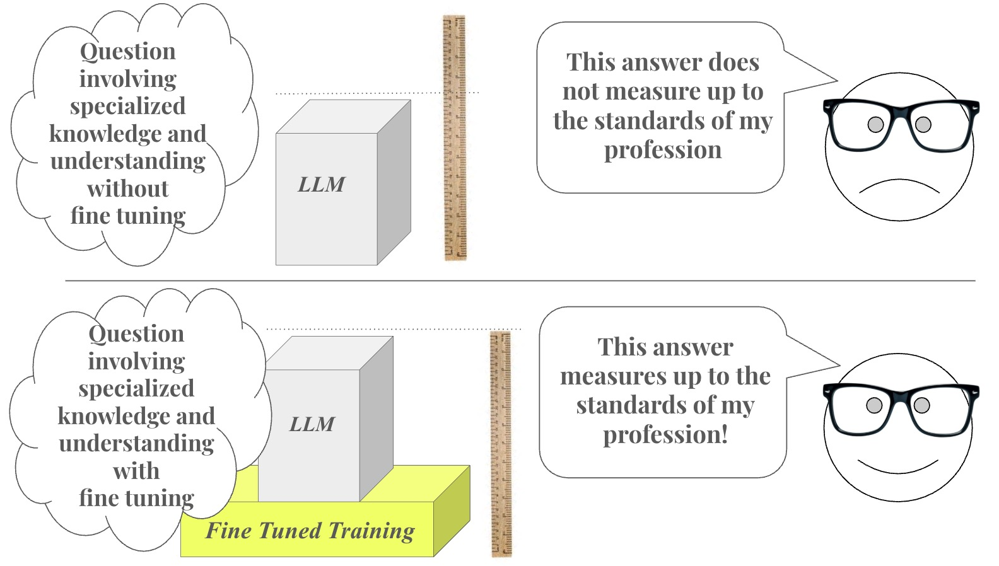

[&larr; Prev](#slide-26) | [Next &rarr;](#slide-28)

---

## [Examples of Fine-Tuning]{#slide-28}

A model fine-tuned on NBA coaching manuals, analytics columns, and scouting reports absorbs the internal language and professional intuition of basketball analysis.

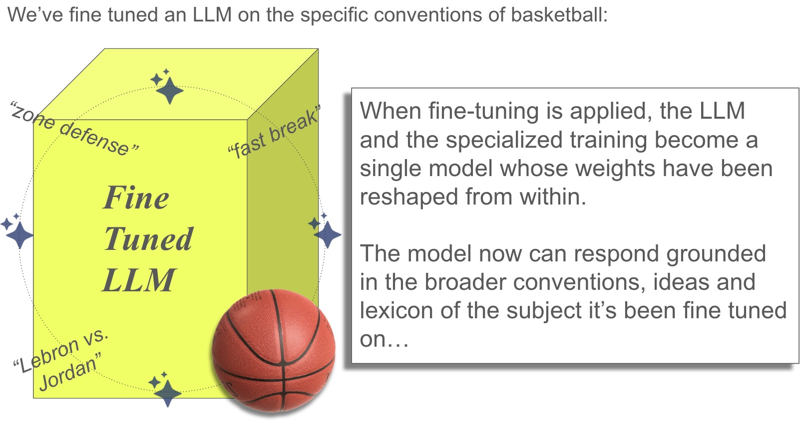

[&larr; Prev](#slide-27) | [Next &rarr;](#slide-29)

---

## [RAFT: Retrieval-Augmented Fine-Tuning]{#slide-29}

RAFT combines fine-tuning and RAG so that a model has both the domain instincts of a specialist and the ability to retrieve real documents at the moment a question is asked.

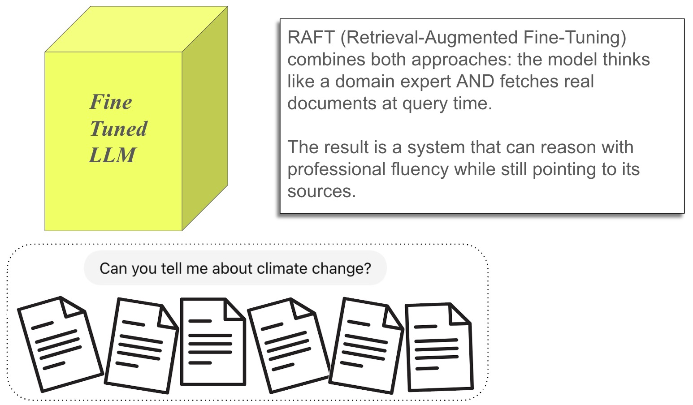

[&larr; Prev](#slide-28) | [Next &rarr;](#slide-30)

---

## [Conclusion]{#slide-30}

Baruch's academic databases increasingly AI-assisted discovery — and as you enter the workforce you will encounter domain-specific AI tools built for your profession — but true AI literacy means understanding a tool's limits just as clearly as its strengths, and never outsourcing the judgment that only you can provide.

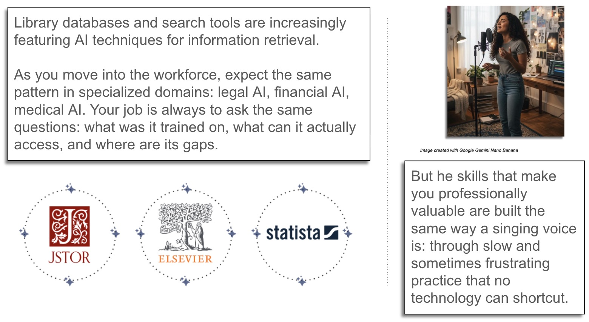

[&larr; Prev](#slide-29)

---
